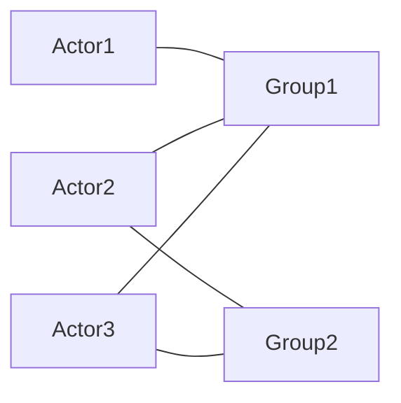
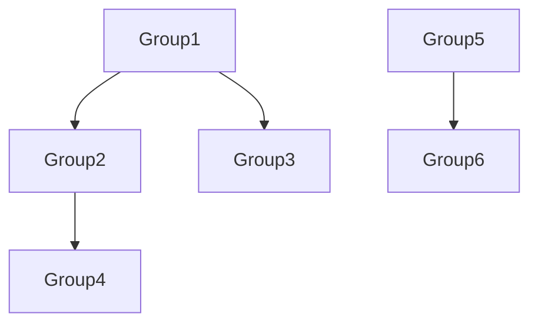
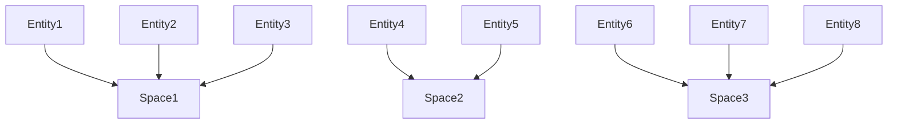
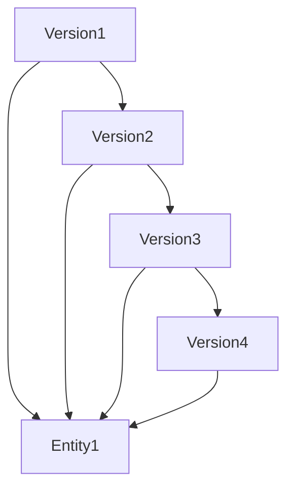

TerseDB
=======

TerseDB is an independent _Entity Management System_ designed to be used alongside any existing
database system you may have running. It is a decoupled solution to the complex problem of
authorizing changes in a "multi-actor" environment; where many people (or systems) may be
manipulating, creating, and deleting many different things concurrently. TerseDB intends to provide
you with:

- the simplicity of only having to worry about storing and retreiving things, not the authorization
  of "who gets to view it"
- a simple, limited HTTP API for queries on entities
- plugins to various database vendors to allow for easier rich database queries, like full text
  search

## Semantics

### Identifiers

ID's are 12-byte random hexadecimal strings, similar to a MongoDB `ObjectId`. There are 5
variants of this concept - `ActorId`, `GroupId`, `VersionId`, `EntityId`, and `SpaceId`.

### Permission

There are two variants of permission - one for collections, and the other to describe a single
element of a collection. They are noted as `CollectionPermission` and `SinglePermission`,
respectively.

`CollectionPermission` can be one of the following: `Blind`, `Read`, `Create`,
`Update`, and `Delete`; where the lest amount of permission is `Blind` (can't see any elements),
and the most is `Delete` (can delete any element).

`SinglePermission` can be one of the following: `NonExistent`, `Exists`, `Adjust`, and `Obliterate`.
Conversely, the least amount of _granted_ permission is `Exists`, and the most is `Obliterate`
(similarly to `Read` and `Delete`), but `NonExistent` actually _restricts_ permission for the
actor. Also note that there is no `Create` analogue, as the single element of the collection
would already exist.

The idea is this permission system should be capable of building a heirarchy - a `SinglePermission`
can represent a _single_ collection - a `CollectionPermission` can bear many _single_ elements.
In this latter case, there is one additional dimension of permission - being exempt from
restrictions caused by single elements. In this case, we represent the exemption as either being
`Exempt` or `NotExempt`, in addition to its `CollectionPermission`.

### Actors

Actors can perform actions to the system - whether its to other actors, groups that actors
inhabit, entities being tracked, spaces of entities, or versions within those entities.
Any action performed on the system will be commited by __one or more__ actors.

The collection of actors are governed by those with recruiter rights.

### Groups

Groups grant permission to its actors, who are members of the group.

Membership is seen as a many-to-many relationship.

Groups can also inherit one another like a tree:

Permissions from each group are strictly additive - the effective permissions granted in
`Group4` will be the sum (or max, depending on how you want to look at it) of all permissions
granted individually in `Group1`, `Group2`, and `Group4`.

The collection of groups is governed by those with organizational rights.

The collections of memberships for groups are governed by those with membership rights for those
groups.

### Spaces, Entities, and Versions

Spaces are the collections of entities. Every entity belongs to exactly 1 space, which makes
spaces disjoint sets of entities:

Versions are linked lists, each cohesively belonging to a single entity. Every entity has at least
one version.

